<div align="center">

# 💻 Collab Spaces

**The everything app for your time, tasks, and teams.**

Real-time, AI-powered workspaces that bring tasks, notes, chat, calendar, Pomodoro, files, quizzes, and analytics together in one place, with roles built around how classrooms, teams, and study groups actually work.


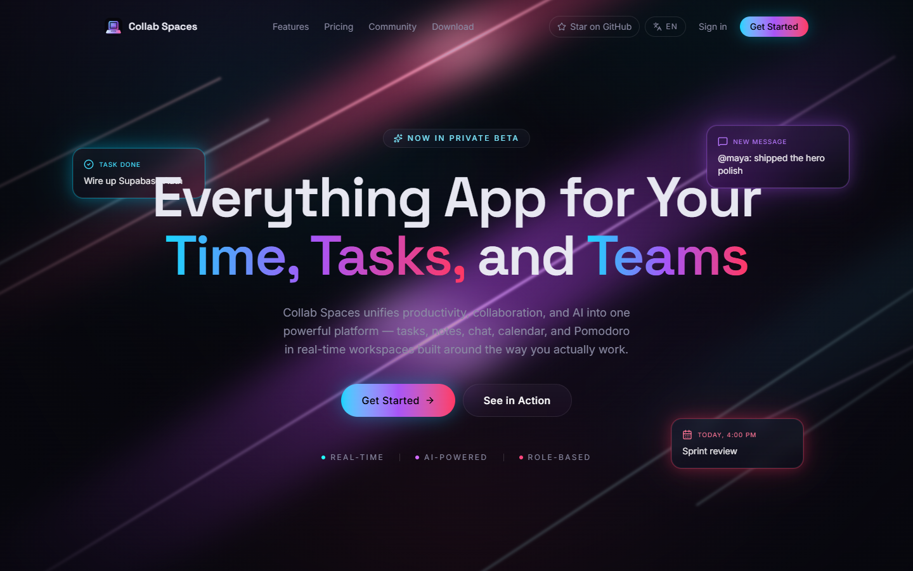

</div>

---

## Table of contents

- [Why Collab Spaces](#why-collab-spaces)
- [Screenshots](#screenshots)
- [Features](#features)
- [Tech stack](#tech-stack)
- [Getting started](#getting-started)
- [Project structure](#project-structure)
- [Scripts](#scripts)
- [Documentation](#documentation)

## Why Collab Spaces

Most groups use Notion for notes, Slack for chat, Jira or Trello for tasks, and a separate timer app for focus. Collab Spaces replaces that patchwork with **workspaces**. Each one is a shared space where every module syncs in real time, and each comes with role-aware permissions for the kind of group using it:

| Workspace type | Roles | Built for |
|---|---|---|
| 🎓 **Teacher–Student** | Teacher (admin) · Students | Assigning work, sharing materials, auto-generated quizzes, tracking every student |
| 💼 **Leader–Employee** | Leader (admin) · Employees | Assigning tasks and deadlines, announcements, live productivity tracking |
| 👥 **Work Group** | Equal members | Shared projects: create and assign tasks, share files, ship together |
| 📚 **Student Group** | Equal learners | Studying with friends: shared notes, study tasks, streaks |
| 🙋 **Personal** | Just you | Tasks, calendar, routines, notes, and a Pomodoro timer that builds your streaks |
| 🧩 **Custom** | You decide | Pick exactly which modules you want inside |

## Screenshots

### Landing page

| | |
|---|---|
| 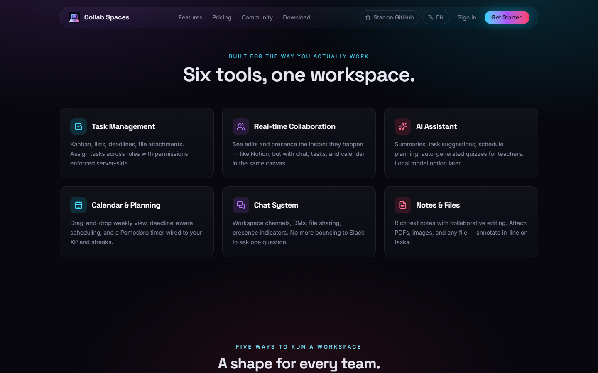 | 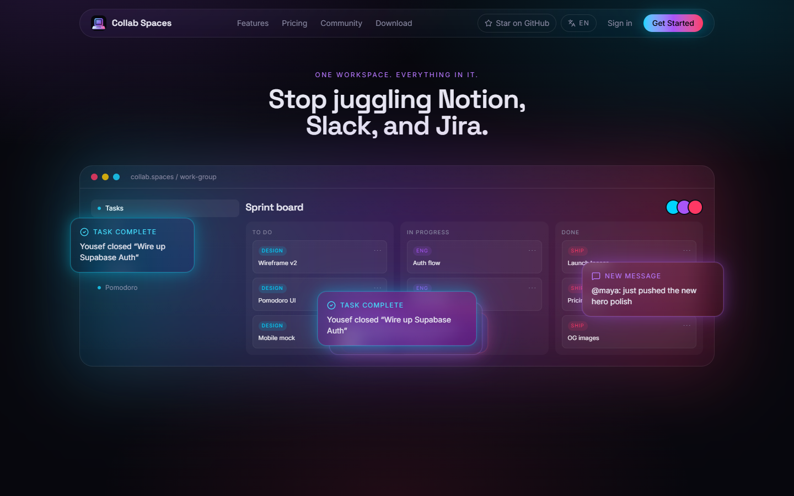 |
| **Six tools, one workspace:** the core feature set | **See it in action:** an animated product preview |
| 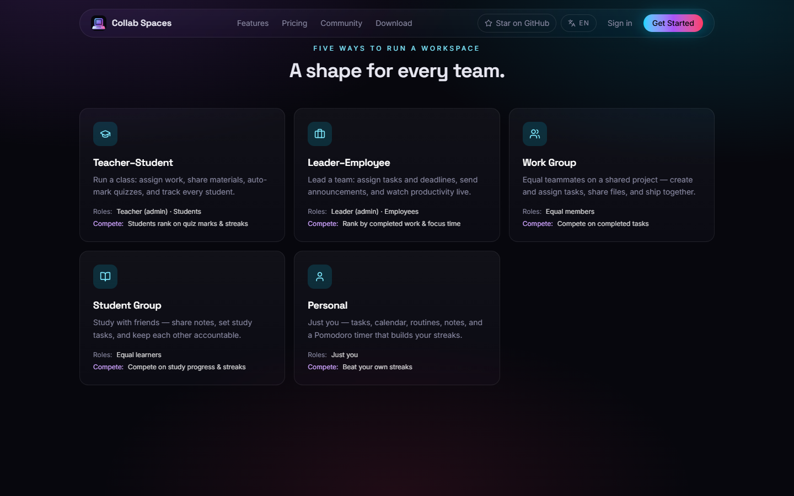 | 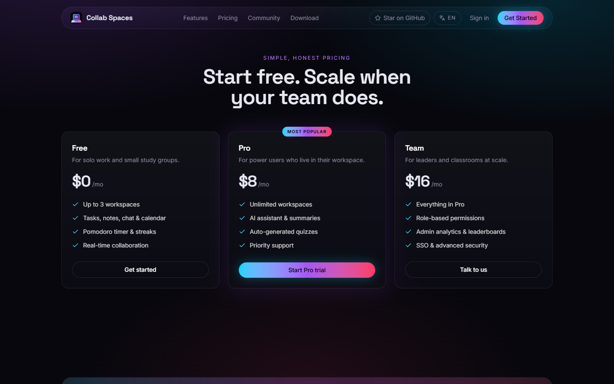 |
| **A shape for every team:** five workspace types | **Pricing:** Free, Pro, and Team tiers |

### Authentication

| | |
|---|---|
| 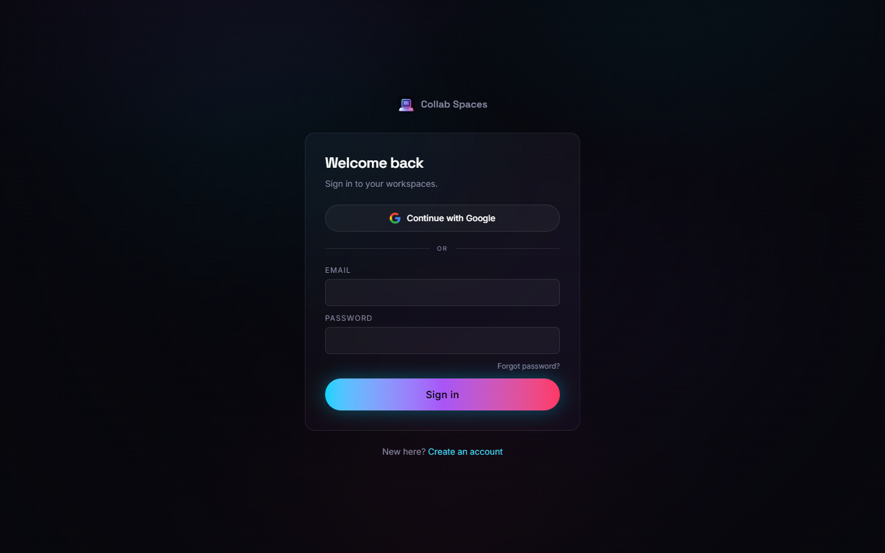 | 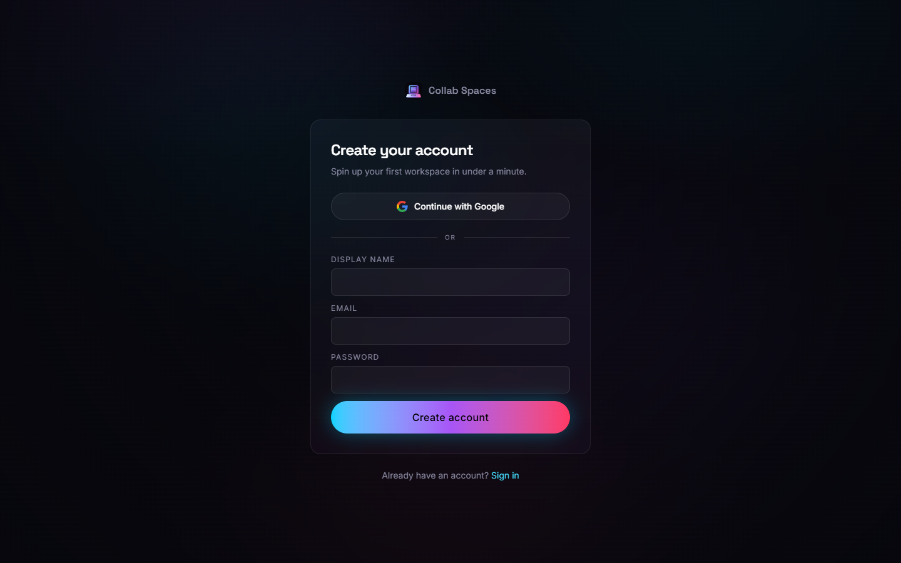 |
| **Sign in** with email/password or Google | **Create an account** and spin up a workspace in under a minute |

### Inside the app

| | |
|---|---|
| 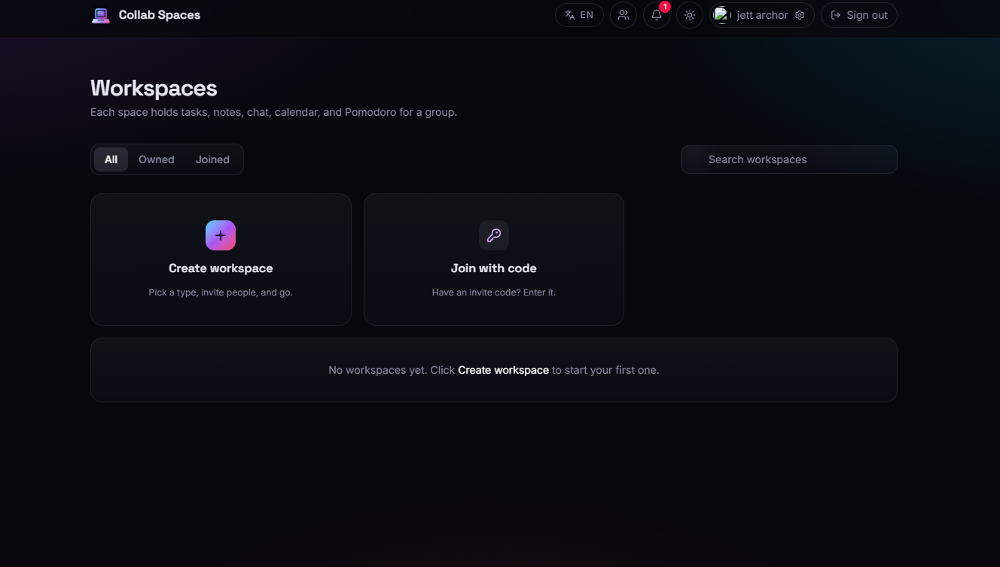 | 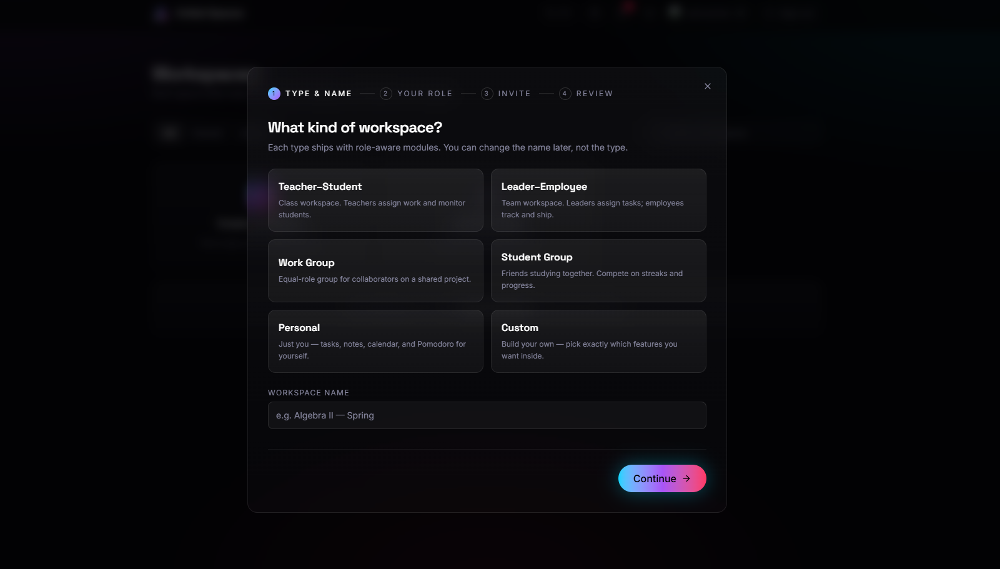 |
| **Dashboard:** all, owned, and joined workspaces with search | **Create workspace:** a four-step wizard (type & name, role, invite, review) |
| 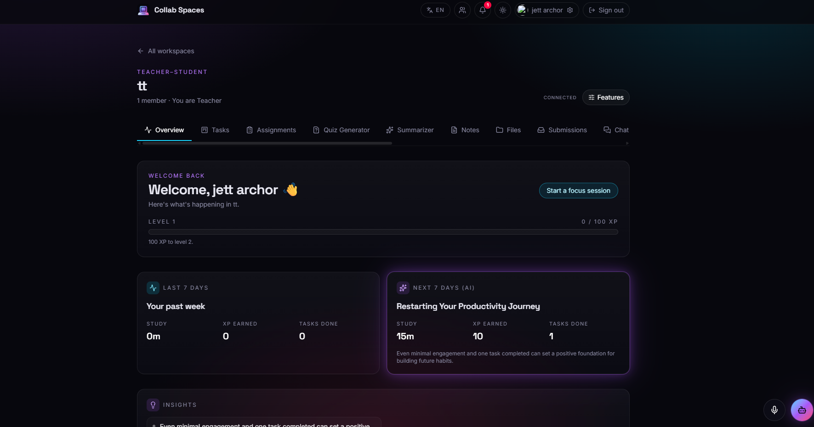 | 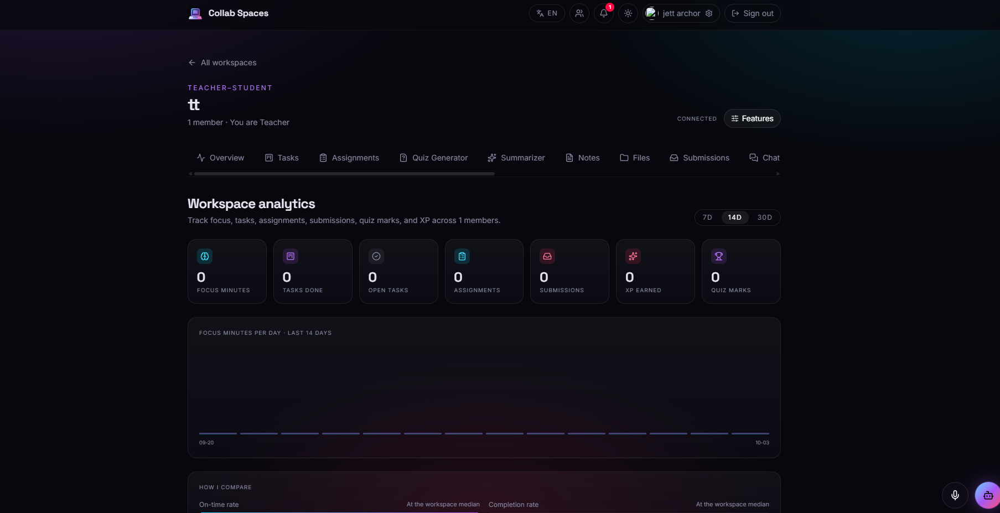 |
| **Overview:** XP and level, last week's stats, and an AI forecast for the next 7 days | **Analytics:** focus minutes, tasks, assignments, submissions, XP, and quiz marks |
| 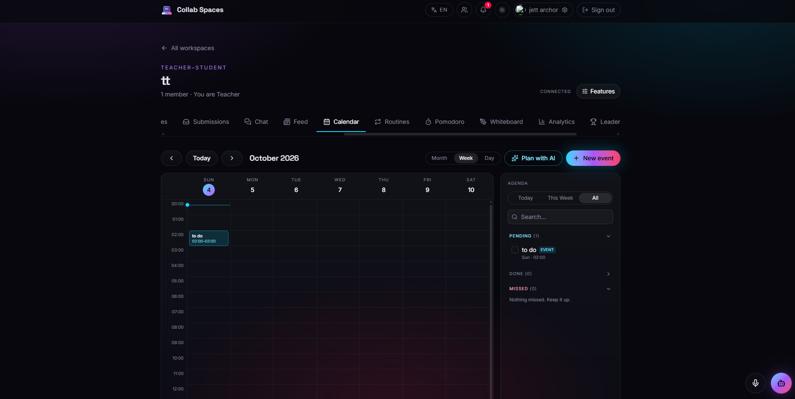 | 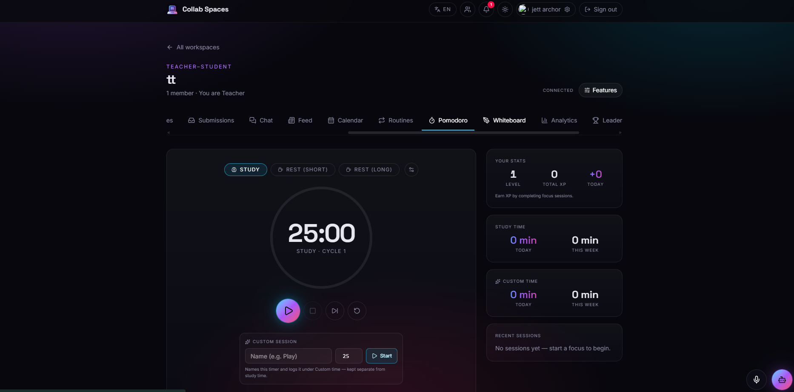 |
| **Calendar:** month/week/day views, a Pending/Done/Missed agenda, and **Plan with AI** | **Pomodoro:** focus/rest cycles, custom sessions, XP, and study-time stats |

<p align="center">
  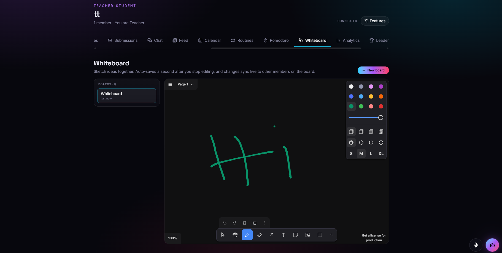<br>
  <b>Whiteboard:</b> a collaborative canvas with live multi-cursor sync between members
</p>

## Features

### Workspace modules

Each workspace shows a role-aware set of modules as tabs, and owners can toggle them with **Features**.

- **Overview**: a personal welcome, XP and level progress, weekly stats, and AI-generated insights
- **Tasks**: Kanban board and list views, multiple assignees, priorities, due dates, file attachments, an activity log, and automatic *missed* and *due soon* tracking
- **Assignments & Submissions**: teachers and leaders hand out work, members submit it, admins review it
- **Quiz Generator**: AI-generated quizzes from pasted text or uploaded files (PDF, images, docs), with difficulty, language, deadline, and per-student targeting
- **Summarizer**: streaming AI summaries of uploaded files or pasted text
- **Notes**: a rich-text editor (TipTap) with task lists, code blocks, callouts, backlinks, a command palette, and search
- **Chat**: workspace channels and direct messages, reactions, emoji, safe inline markdown, and file sharing
- **Files**: a folder tree with inline image, PDF, and text previews
- **Feed**: announcements and posts with severity levels, pinning, reactions, and rich link previews
- **Calendar**: month, week, and day views, drag-to-reschedule tasks, an agenda panel, and AI session planning
- **Routines**: recurring routines with date bounds, personal by default and shareable if you choose
- **Pomodoro**: focus and rest cycles, custom timers, a session log, and XP rewards
- **Whiteboard**: tldraw-powered boards with autosave and live multi-cursor collaboration
- **Analytics & Leaderboard**: per-member stats, CSV export, a "How I compare" view, and streak and XP rankings
- **Members**: online/away/offline presence, invite by email or join code, and friends
- **Password Vault**: client-side encrypted secrets (AES-GCM 256 with a PBKDF2-derived key that never leaves the browser)
- **AI News**: the last 24 hours of AI news, gathered by Gemini and cached on the server

### Across the app

- 🤖 **AI assistant chatbot**: can list workspaces, read analytics, and create or update tasks. Any action that changes data needs your explicit confirmation first.
- 🎙️ **Voice dictation**: speak into any text field (Web Speech API, English and Arabic)
- ⚡ **Real-time everything**: Supabase Realtime keeps tasks, chat, the feed, presence, and the whiteboard in sync
- 🔔 **Notifications**: task assigned, due soon, missed, quiz assigned, and more
- 🌍 **Internationalization**: English and Arabic, with RTL support
- 🌗 **Themes**: light, dark, or system, plus adjustable font size
- 🔐 **Security**: Postgres row-level security (RLS) is the security boundary, with Google sign-in, account linking, active-session management, and self-service account deletion
- ♿ **Accessibility**: respects `prefers-reduced-motion` and uses 24-hour time everywhere

## Tech stack

| Layer | Technology |
|---|---|
| Frontend | React 19, TypeScript, Vite, React Router 7 |
| Styling & motion | Tailwind CSS 4, shadcn/ui-style components, GSAP, ReactBits |
| Editors & canvas | TipTap (notes), tldraw (whiteboard), dnd-kit (drag & drop), Recharts (charts) |
| Backend | Supabase: Postgres, Auth, Realtime, Storage, and RLS policies |
| Server functions | Supabase Edge Functions (Deno): `ai` (Gemini), `account`, `og` (link previews) |
| AI | Google Gemini via the `ai` edge function (chat with tools, summaries, quizzes, planning) |

## Getting started

### Prerequisites

- [Node.js](https://nodejs.org/) 20.19+ or 22.12+ (required by Vite 8)
- [pnpm](https://pnpm.io/) 10 (`corepack enable` installs the version pinned in `package.json`)
- A [Supabase](https://supabase.com/) project
- The [Supabase CLI](https://supabase.com/docs/guides/cli), to deploy the edge functions
- A [Google Gemini API key](https://aistudio.google.com/apikey), for the AI features

### 1. Install

```bash
git clone <your-repo-url> collab-spaces
cd collab-spaces
pnpm install
```

### 2. Configure environment

```bash
cp apps/web/.env.example apps/web/.env.local
```

Then fill in your Supabase project values:

```env
VITE_SUPABASE_URL=https://<project-ref>.supabase.co
VITE_SUPABASE_ANON_KEY=<your-anon-key>
```

### 3. Set up the database

Apply every SQL file in [`supabase/migrations/`](supabase/migrations) **in numeric order**, using the Supabase Studio SQL Editor or `supabase db push`. The migrations are idempotent, so re-running one that's already applied changes nothing. They also create all the storage buckets the app needs.

### 4. Deploy the edge functions

```bash
supabase link --project-ref <project-ref>
supabase secrets set GEMINI_API_KEY=<your-gemini-key>

supabase functions deploy ai        # AI chatbot, summaries, quizzes, planning
supabase functions deploy account   # self-service account deletion
supabase functions deploy og        # link previews in the feed
```

To use **Continue with Google**, enable the Google provider under Supabase **Authentication → Sign In / Providers**.

### 5. Run

```bash
pnpm dev
```

Then open **http://localhost:5173**.

## Project structure

```
collab-spaces/
├── apps/
│   └── web/                      # Vite + React + TypeScript app
│       └── src/
│           ├── components/       # shared UI (nav, notifications, voice widget, ui/)
│           ├── lib/
│           │   ├── data/         # data layer: the only place that talks to Supabase
│           │   ├── i18n/         # English and Arabic dictionaries
│           │   ├── theme/ voice/ vault/ pomodoro/ auth/
│           └── routes/
│               ├── landing/      # marketing site
│               ├── auth/         # sign in, sign up, password reset, OAuth callback
│               ├── onboarding/
│               └── app/          # dashboard, settings, and workspace modules
├── supabase/
│   ├── migrations/               # schema, RLS policies, RPCs, triggers, storage buckets
│   └── functions/                # Deno edge functions: ai, account, og
└── docs/screenshots/             # images used in this README
```

## Scripts

Run these from the repo root:

| Command | What it does |
|---|---|
| `pnpm dev` | Start the Vite dev server at http://localhost:5173 |
| `pnpm build` | Type-check and build the production bundle into `apps/web/dist` |
| `pnpm preview` | Serve the production build locally |
| `pnpm typecheck` | Run the TypeScript type check (`tsc --noEmit`) |

## Documentation

- [`DOCUMENTATION.md`](DOCUMENTATION.md): full technical reference covering the data model, modules, and libraries
- [`DEPLOYMENT.md`](DEPLOYMENT.md): ordered deployment runbook for migrations, edge functions, secrets, and optional `pg_cron` jobs
- [`ARCHITECTURE.md`](ARCHITECTURE.md): high-level architecture overview

---

<div align="center">
Built by <b>Youssef Awad Sadek</b>
</div>
